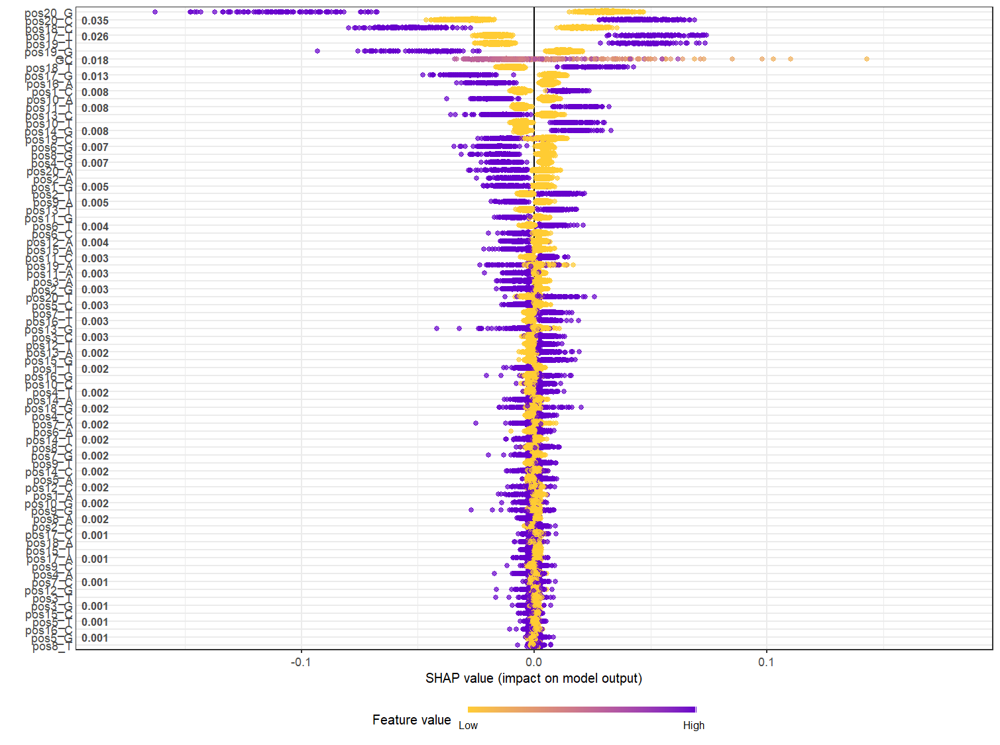

# Advanced-Bioinformatics

Improving CRISPR KO Screening

## Data Preprocessing

Following the quality control, the data points from GeCKO library B were extracted resulting in 58,028 sgRNAs. The data points corresponding to non-targeting control sgRNAs were removed along with the three sgRNAs with mismatched gene identifiers between the data sheets. The resulting data set contains 57,025 sgRNAs.

Initially only the sgRNA counts from the BC3 cell line were used. The log2 Fold Change between day 0 and day 14 was computed using the DESeq2 library. The gene-level average of log2 Fold Change was subtracted from these values to account for differences in sgRNA abundance between genes. These values were then used as the dependent variable to estimate sgRNA efficacy.

To model the sgRNA efficacy, the guide sequence composition was used. The overall GC-content was computed as the ratio of Guanine (G) and Cytosine (C) in the guide. Position-wise nucleotide composition was also used as input for the model.

This data was subseqeuntly divided into training data (80%) and testing data (20%).

The data preprocessing procedure can be found in: "R/03_data_preprocessing.R"

## Model

XGBoost (Extreme Gradient Boosting) was used to model log2FoldChange of sgRNA counts by sequence composition. XGBoost is a scalable gradient boosting framework. The model builds sequential decision trees, with each tree attempting to improve the predictions of the previous trees.

The response variable was the log2 fold change in sgRNA abundance and the predictor variables the sequence-composition features generated during pre-processing of data.

The training data was used to fit the model and for cross-validation during hyperparameter optimizations, whereas the testing data was only used for the evaluation of the final model.

## Hyperparameter Optimization

Hyperparameters eta, gamma, max_depth, subsample, colsample_bytree, and min_child_weight were optimized. Hyperparameter optimization was performed using 5-fold cross-validation on the training data. The number of boosting rounds was also determined during cross-validation using early stopping.

For each parameter configuration up to 1,000 boosting rounds were evaluated, stopping training when RMSE failed to improve for 30 consecutive rounds. The parameters were optimized sequentially in the previously stated order, retaining the selected parameter value from the previous optimization.

The cross-validation Root Mean Squared Error (CV RMSE) was used to select parameter values, where a lower value indicates a lower prediction error.

### eta

eta or learning rate sets the step size shrinkage used in update to prevent overfitting. The default value for eta for a Tree Booster model is 0.3 and the parameter has a range of 0 to 1. For the optimization three values larger than 0.3 (0.4, 0.5 and 0.6) and four values smaller than 0.3 (0.15, 0.1, 0.05 and 0.01) were investigated.

Reported for each tested value is the cross-validation RMSE and Mean Absolute Error (MAE).

|         |            |            |           |
|---------|------------|------------|-----------|
| **eta** | **rounds** | **cvRMSE** | **cvMAE** |
| 0.01    | 367        | 0.3433922  | 0.2482152 |
| 0.05    | 98         | 0.3433667  | 0.2484601 |
| 0.10    | 55         | 0.3433520  | 0.2485614 |
| 0.15    | 33         | 0.3435033  | 0.2487028 |
| 0.30    | 11         | 0.3443716  | 0.2491790 |
| 0.40    | 9          | 0.3449174  | 0.2497336 |
| 0.50    | 4          | 0.3448009  | 0.2493959 |
| 0.60    | 3          | 0.3459035  | 0.2501063 |

Out of the tested values, eta = 0.1 produced the lowest CV RMSE and was used for subsequent optimizations.

### gamma

gamma or min_split_loss refers to the minimum loss reduction required to make a split. A larger value makes the model more conservative. The default value for a Tree Booster is 0 and the range of the parameter is 0 to infinity. Gamma values 0, 0.05, 0.1, 0.15, 0.2 and 0.3 were investigated.

|           |            |            |           |
|-----------|------------|------------|-----------|
| **gamma** | **rounds** | **cvRMSE** | **cvMAE** |
| 0.00      | 55         | 0.3433520  | 0.2485614 |
| 0.05      | 54         | 0.3433563  | 0.2485404 |
| 0.10      | 50         | 0.3433464  | 0.2485400 |
| 0.15      | 54         | 0.3432921  | 0.2485587 |
| 0.20      | 43         | 0.3433566  | 0.2483293 |
| 0.30      | 43         | 0.3434268  | 0.2483635 |

Out of the tested values, gamma = 0.15, generated the lowest CV RMSE and was selected for subsequent optimizations.

### max_depth

The max_depth hyperparameter controls the maximum depth of a tree. Increasing this value causes the model to become more complex and more likely to overfit the data. The default value for max_depth for a Tree Booster is 6, with the range 0 to infinity. Investigated values of max_depth were 3, 4, 5, 6, 7, 8 and 9.

|               |            |            |           |
|---------------|------------|------------|-----------|
| **max_depth** | **rounds** | **cvRMSE** | **cvMAE** |
| 3             | 122        | 0.3431102  | 0.2480496 |
| 4             | 94         | 0.3430050  | 0.2480635 |
| 5             | 58         | 0.3430825  | 0.2481715 |
| 6             | 54         | 0.3432921  | 0.2485587 |
| 7             | 42         | 0.3437284  | 0.2490089 |
| 8             | 30         | 0.3444012  | 0.2494270 |
| 9             | 21         | 0.3451389  | 0.2499647 |

From the tested values, max_depth = 4 generated the lowest CV RMSE and was selected for subsequent optimizations.

### subsample

This parameter controls the subsample ratio of the training data. A value of 0.5 means that the model would randomly sample half the data prior to growing trees. The default value for a Tree Booster is subsample = 1 with a range of 0 to 1. Selected for investigation were values 1, 0.9, 0.8, 0.7, 0.6 and 0.5.

|               |            |            |           |
|---------------|------------|------------|-----------|
| **subsample** | **rounds** | **cvRMSE** | **cvMAE** |
| 1.0           | 94         | 0.3430050  | 0.2480635 |
| 0.9           | 99         | 0.3428889  | 0.2481280 |
| 0.8           | 83         | 0.3429983  | 0.2481364 |
| 0.7           | 75         | 0.3429402  | 0.2481046 |
| 0.6           | 79         | 0.3430629  | 0.2482123 |
| 0.5           | 78         | 0.3431955  | 0.2483249 |

From the tested values, subsample = 0.9 generated the lowest CV RMSE and was selected for subsequent optimizations.

### colsample_bytree

The colsample_bytree parameter is the subsample ratio of columns when constructing each tree. The default value for a Tree Booster is 1 with a range of 0 to 1. Selected for investigation were values 1, 0.9, 0.8, 0.7, 0.6 and 0.5.

|                      |            |            |           |
|----------------------|------------|------------|-----------|
| **colsample_bytree** | **rounds** | **cvRMSE** | **cvMAE** |
| 1.0                  | 99         | 0.3428889  | 0.2481280 |
| 0.9                  | 96         | 0.3429275  | 0.2480598 |
| 0.8                  | 103        | 0.3429363  | 0.2480592 |
| 0.7                  | 87         | 0.3429266  | 0.2479494 |
| 0.6                  | 85         | 0.3430358  | 0.2480626 |
| 0.5                  | 102        | 0.3429448  | 0.2481216 |

From the tested values, colsample_bytree = 1 generated the lowest CV RMSE and was selected for subsequent optimizations.

### min_child_weight

This parameter determines the minimum sum of instance weight needed in a child. For a Tree Booster the default value i 1 with a range of 0 to infinity, where 0 indicates no limit. Selected for investigation were values 0, 0.5, 1, 2, 5 and 10.

|                      |            |            |           |
|----------------------|------------|------------|-----------|
| **min_child_weight** | **rounds** | **cvRMSE** | **cvMAE** |
| 0.0                  | 99         | 0.3428889  | 0.2481280 |
| 0.5                  | 99         | 0.3428889  | 0.2481280 |
| 1.0                  | 99         | 0.3428889  | 0.2481280 |
| 2.0                  | 99         | 0.3429156  | 0.2480989 |
| 5.0                  | 89         | 0.3428992  | 0.2480411 |
| 10.0                 | 99         | 0.3429025  | 0.248098  |

From the tested values, min_child_weight 0, 0.5 and 1 generated identical CV RMSE values.

## Selected Hyperparameters

The sequential optimization resulted in the following selected parameters:

| Parameter        | Selected Value |
|------------------|----------------|
| eta              | 0.1            |
| gamma            | 0.15           |
| max_depth        | 4              |
| subsample        | 0.9            |
| colsample_bytree | 1              |
| min_child_weight | 0              |

After selecting these parameter values, a final cross-validation identified 192 boosting rounds.

The optimization procedure can be found in: "R/04_model_optimization.R"

## basicstats Package

An R package was developed which computes root mean squared error (RMSE), mean absolute error (MAE), R-squared (R2) and correlation coefficients between a set of observed and predicted values.

A separate documentation was set up for the basicstats package using pkgdown.

## Final Model Evaluation

The final XGBoost model was trained on the complete training dataset using the selected hyperparameters and 192 boosting rounds. The held-out test dataset was then used to obtain an independent evaluation of model performance. The package basicstats was used to compute RMSE, MAE, R2 and Spearman's correlation coefficients between the observed and predicted datasets for the training data and the held-out testing data. The result of this analysis is shown in the table below.

|  |  |  |  |  |  |  |  |  |
|--------|--------|--------|--------|--------|--------|--------|--------|--------|
| **rounds** | **trainRMSE** | **testRMSE** | **trainMAE** | **testMAE** | **trainR2** | **testR2** | **trainSpearman** | **testSpearman** |
| 99 | 0.3373792 | 0.3415414 | 0.244122 | 0.2470134 | 0.0848238 | 0.05460637 | 0.2790285 | 0.2245557 |

Measuring RMSE between observed and predicted values, the model performed similarly for the training and testing data, ca 0.34. The calculated MAE values were also similar between the datasets, 0.24 and 0.25 for the training and testing data respectively. The calculated Spearman correlation between observed and predicted values was 0.28 for the training-set and 0.22 for the testing-set. The computed R-squared for the final model was 0.05 for the test-data, whereas the R-squared for the training-data was 0.08.

The model showed positive association between predicted and observed sgRNA efficacy, and prediction errors were similar for both the training and testing data. The code for the final model evaluation can be found in: "R/05_final_model.R"

## SHAP

SHaplet Additive exPlanation was used to investigate how sequence features contributed to the predictions of the final model. SHAP analysis was performed on the final model after hyperparameter optimization.

# 
